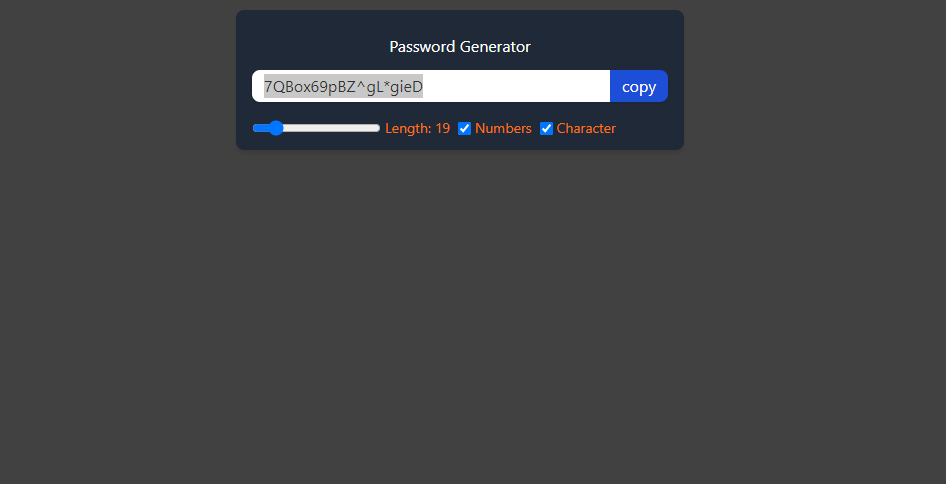
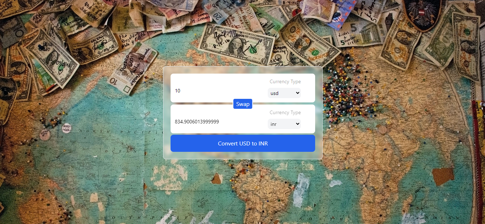
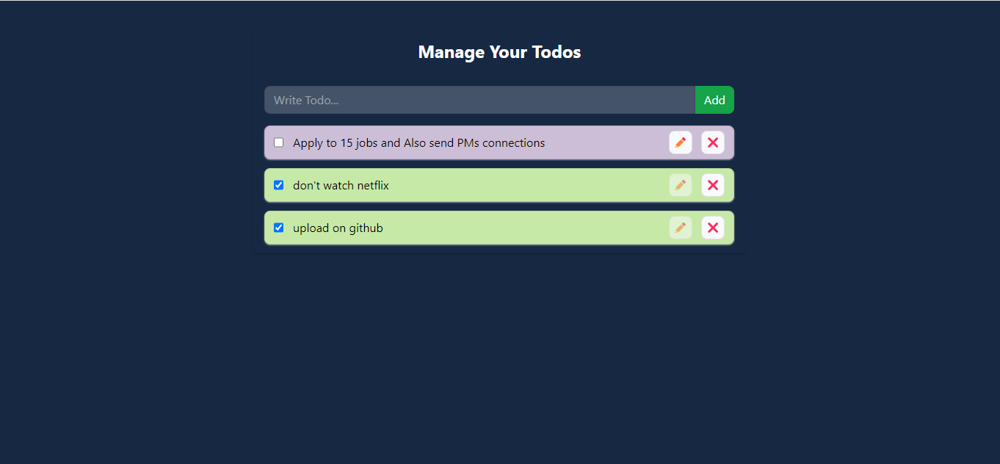

# 10 React Projects

### Description
Implemented 10 projects using React JS (using Vite) and Tailwind CSS while learning both that utilizes core concepts such as components, custom hooks, Single Page Applications, APIs, react-router-dom, Context API, localStorage of browser.
More precise description of some projects with concepts is as below:

1. **01_customReact**: Built without any build tools such as Vite to understand the behavior of React and what it actually does while rendering a component.
2. **02_counter**: A basic counter project with +1 and -2 buttons to understand the useState hook.
3. **03_tailWindCssProps**: Utilizes props for components using a Card component to understand how props make components reusable.
4. **04_changebgColor**: Changes background color to red, green, or blue using the useState hook on a button click.
5. **05_password_generator-v2**: Generates a password of a chosen length and allows the selection of numbers or special characters with a checkbox. Uses useEffect, useRef, and useCallback hooks.
6. **06_currency_converter**: Fetches API data to get current exchange rates for selected currencies and converts the amount. Uses a custom hook `useCurrencyInfo`, and the useEffect hook.
7. **07_reactRouterPortfolio**: Demonstrates Single Page Applications (SPAs) by building a simple portfolio webpage where the Header and Footer are constant, and only the middle components change (e.g., Home, Contact, GitHub).
8. **08_miniContext**: Explores Context API, including createContext, useContext, and context provider. Stores login information ({username, password}) in UserContext, which is then accessed by the Profile component to display the username.
9. **09_themeSwitcher**: Another way of defining Context, with only one file, ThemeContext.jsx, for one context. A toggle button changes the theme of a component. The current theme is stored within the Context and updates accordingly when toggled.
10. **10_todoLocalContext**: Utilizes all concepts, including the browser's localStorage, to build a todo list app. Uses Context API and localStorage to get and set todo items. Allows adding, removing, editing, and marking todo tasks as completed.

### Screenshots of a few projects
* **Password Generator**:
  


* **Currency Converter**:
  


* **Todo List Project**:
  


## How to use:
Well, I've used Vite as the build tool for these projects. Once you clone the repository:

```sh
1. Simply, change directory a particular project directory in the terminal:
> cd project_directory

2. npm run dev command
> npm run dev

3. Open browser and type
> http://localhost:5173
Or the port number reflecting in the terminal.
```

### Note: This can be a good learning source for someone who wants to learn React with Practical implementation of each topic. Please let me know if you find any errors.
